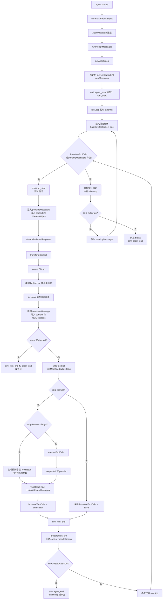

# Agent Loop从最简到叠加

学习 Agent Loop 时，我一直沿着一个简单任务往下追：**“读取 `src/main.ts`，再解释它的作用。”** 模型第一次被调用时还看不到文件内容，通常会先提出 `read` 工具调用；Runtime 执行工具、把结果写回上下文，模型才能在下一轮给出解释。这条“模型 → 工具 → 结果 → 模型”的数据流，就是理解整篇内容的主线。

## 1. 大模型的三种用法

### 直接调用

最简单的方式是调用一次模型，拿到一次回答。

```text
用户输入 → 构建 Prompt → 调用模型 → 返回结果
```

翻译、摘要和简单问答通常不需要观察外部环境，一次调用就够了。

### Workflow

任务复杂以后，可以由程序预先安排多个步骤：

```text
模型分析 → 程序提取信息 → 模型生成 → 程序检查 → 输出
```

模型虽然被调用多次，但流程走向主要由代码决定。程序知道下一步是什么，也知道什么时候结束。

### Agent Loop

Agent 面对的是无法提前写死步骤的任务。读取哪些文件、是否搜索代码、要不要运行测试，都要根据执行过程中得到的新信息再决定。模型把下一步动作写成 `toolCall`，Runtime 再把它变成真正的工具调用：

```text
模型判断 → 提出 toolCall → Runtime 执行工具
    ↑                              ↓
    └──────── ToolResult 写回上下文 ────────┘
```

模型负责提出下一步动作，Runtime 负责安全执行和继续循环。这里的“自主”不是模型拥有全部控制权，而是原来写死在程序里的下一步，改成由模型在运行时用 `toolCall` 提出来。

| 对比项 | 直接调用 | Workflow | Agent Loop |
| --- | --- | --- | --- |
| 模型调用次数 | 一次 | 多次，数量通常已知 | 多次，数量运行时决定 |
| 下一步由谁决定 | 用户 | 程序流程 | 模型输出与 Runtime 规则 |
| 主要工程工作 | Prompt | 流程编排 | 工具、上下文与循环控制 |

## 2. Loop、Runtime 和 Harness 是什么关系

前面的循环只说明了“模型和工具怎样来回传递信息”。要让它变成一个可以长期运行、可以被用户打断、也不会乱执行操作的 Agent，还需要把循环放进更大的运行框架里。这三个词描述的就是不同范围。

**Agent Loop** 是最内层的反馈算法：调用模型，执行工具，把工具结果交回模型，再判断是否继续。

**Agent Runtime** 是让 Loop 真正跑起来的执行引擎。除了循环，它还要维护上下文、调度工具、发送事件、处理取消和错误，并执行停止规则。Pi 的 `runAgentLoop()`、`runLoop()`、消息转换和工具执行都属于 Runtime 的核心部分。

**Agent Harness** 的范围更大。它把 Runtime 与模型供应商、工具和运行环境、状态和会话、系统提示词、权限控制以及 CLI/UI 组装成一个完整 Agent。

```text
Agent Harness
├── Model / Provider
├── Agent Runtime
│   ├── Agent Loop
│   ├── Context / Events
│   ├── Tool Execution
│   └── Stop / Abort Rules
├── Tools / Environment
├── State / Session
└── CLI / UI
```

Runtime 不会凭空拥有这些能力，它使用 Harness 提供的工具、权限和运行环境，并负责把每次动作安全地串起来。打个比方，Loop 是车辆反复前进的动作，Runtime 是带刹车和仪表的车辆，Harness 则把车辆、道路接口、地图和驾驶舱一起准备好。

在 Pi 中也能看到类似分层：`pi-ai` 统一不同模型供应商，`pi-agent-core` 提供 Agent Runtime，`pi-coding-agent` 再加入编程工具、会话和交互界面，形成完整的 Coding Agent Harness。

所以这三者不是并列关系，而是逐层扩大的关系：

```text
Agent Loop ⊂ Agent Runtime ⊂ Agent Harness
```

## 3. 先实现一个最简单的 Loop

把工程功能先放到一边，最简 Agent Loop（伪代码）可以写成：

```ts
async function simpleLoop(messages, model, tools) {
  while (true) {
    // ① 调模型
    const response = await callModel(model, messages, tools);
    messages.push(response);

    // ② 没有工具调用 → 结束
    if (response.stopReason !== "toolUse") {
      return messages;
    }

    // ③ 有工具调用 → 执行，把结果喂回去
    for (const toolCall of response.toolCalls) {
      const result = await executeTool(toolCall);
      messages.push(result);
    }
  }
}
```

这里用 `stopReason` 做了最简化判断；Pi 的实际实现还会检查 `content` 里的 `toolCall`，并根据工具返回的 `terminate` 决定是否继续。

它可以拆成四个动作：

1. 调用模型。
2. 从模型回复中提取 `toolCall`。
3. 执行工具并保存 `ToolResult`。
4. 带着新结果再次调用模型；没有工具调用就结束。

这就是 ReAct 的工程形式：Reason（判断）→ Act（行动）→ Observe（观察）→ Reason（再次判断）。

这个循环里的 `await` 也不是把整个程序堵住。模型调用和工具执行返回的都是 `Promise`，当前函数必须等到真实结果，才能检查 `toolCall` 或写入 `ToolResult`；等待期间，JavaScript 仍能处理其他任务。

最简 Loop 已经能跑，但它还没有处理流式输出、用户插队、追加任务、工具并行、错误、取消和外部停止条件。Pi 的实际实现，就是在这个内核外一层层补上这些能力。

## 4. Pi 的 `runLoop()` 实际结构

这段代码按 Pi 的 `runLoop()` 控制流整理，省略了具体类型和工具内部实现，保留双层循环、消息流向和退出位置。

```ts
async function runLoop(
  currentContext,
  newMessages,
  config,
  signal,
  emit,
  streamFn,
) {
  let firstTurn = true;
  let pendingMessages =
    (await config.getSteeringMessages?.()) || [];

  // 外层循环：负责 follow-up
  while (true) {
    // 保证内层至少启动一个 Turn
    let hasMoreToolCalls = true;

    // 内层循环：负责模型调用、工具执行和 steering
    while (
      hasMoreToolCalls ||
      pendingMessages.length > 0
    ) {
      if (!firstTurn) {
        await emit({ type: "turn_start" });
      } else {
        firstTurn = false;
      }

      // 注入 steering 或 follow-up
      for (const message of pendingMessages) {
        await emit({ type: "message_start", message });
        await emit({ type: "message_end", message });
        currentContext.messages.push(message);
        newMessages.push(message);
      }
      pendingMessages = [];

      // 调用模型并获得完整 AssistantMessage
      const streamFunction =
        streamFn || streamSimple;

      const message = await streamAssistantResponse(
        currentContext,
        config,
        signal,
        emit,
        streamFunction,
      );
      newMessages.push(message);

      // 模型调用失败或用户取消：硬停止
      if (
        message.stopReason === "error" ||
        message.stopReason === "aborted"
      ) {
        await emit({
          type: "turn_end",
          message,
          toolResults: [],
        });
        await emit({
          type: "agent_end",
          messages: newMessages,
        });
        return;
      }

      const toolCalls = message.content.filter(
        content => content.type === "toolCall"
      );
      const toolResults = [];
      hasMoreToolCalls = false;

      if (toolCalls.length > 0) {
        const executedToolBatch =
          message.stopReason === "length"
            ? await failToolCallsFromTruncatedMessage(
                toolCalls,
                emit,
              )
            : await executeToolCalls(
                currentContext,
                message,
                config,
                signal,
                emit,
              );

        toolResults.push(
          ...executedToolBatch.messages
        );

        // 表示是否还要让模型观察工具结果
        hasMoreToolCalls =
          !executedToolBatch.terminate;

        for (const result of toolResults) {
          currentContext.messages.push(result);
          newMessages.push(result);
        }
      }

      await emit({
        type: "turn_end",
        message,
        toolResults,
      });

      const nextTurnContext = {
        message,
        toolResults,
        context: currentContext,
        newMessages,
      };

      const nextTurnSnapshot =
        await config.prepareNextTurn?.(
          nextTurnContext
        );

      if (nextTurnSnapshot) {
        currentContext =
          nextTurnSnapshot.context ??
          currentContext;

        config = {
          ...config,
          model:
            nextTurnSnapshot.model ??
            config.model,
          reasoning:
            nextTurnSnapshot.thinkingLevel === undefined
              ? config.reasoning
              : nextTurnSnapshot.thinkingLevel === "off"
                ? undefined
                : nextTurnSnapshot.thinkingLevel,
        };
      }

      if (
        await config.shouldStopAfterTurn?.(
          {
            message,
            toolResults,
            context: currentContext,
            newMessages,
          }
        )
      ) {
        await emit({
          type: "agent_end",
          messages: newMessages,
        });
        return;
      }

      // 收集本 Turn 运行期间的新插队消息
      pendingMessages =
        (await config.getSteeringMessages?.()) || [];
    }

    // 内层自然结束后才检查 follow-up
    const followUpMessages =
      (await config.getFollowUpMessages?.()) || [];

    if (followUpMessages.length > 0) {
      pendingMessages = followUpMessages;
      continue;
    }

    break;
  }

  await emit({
    type: "agent_end",
    messages: newMessages,
  });
}
```

## 5. 按源码拆开每一步

为了不被函数名带偏，先把 `runLoop()` 压成一个最小内核：调一次模型，找出工具调用，执行工具，把结果写回消息，再决定要不要调下一次模型。Pi 在这个内核外面又加上两层循环、流式事件、消息队列和停止钩子。

### 5.1 从 `Agent.prompt()` 到 `runAgentLoop()`

整个 Trace 从 `Agent.prompt()` 开始。

`normalizePromptInput()` 先把字符串、单条消息或消息数组统一为 `AgentMessage[]`。随后 `runPromptMessages()` 创建 context 快照和 config，再调用 `runAgentLoop()`。

`runAgentLoop()` 最重要的三个输入是：

- `prompts`：这次刚收到的消息。
- `context`：当前工作上下文，包括 system prompt、历史消息和工具。
- `config`：运行设置，包括用哪个模型、怎样转换消息、怎样执行工具，以及队列和停止回调。

入口还会创建两份消息：

```ts
const newMessages = [...prompts];
const currentContext = {
  ...context,
  messages: [...context.messages, ...prompts],
};
```

`currentContext.messages` 可以看成这次运行的工作记忆，保存模型下一 Turn 需要看到的完整内容。`newMessages` 是本次 Trace 的新增清单，只收集这次运行产生的消息。AssistantMessage 和 ToolResult 会同时进入两处，但用途不同：一份给模型继续看，一份给外层记录本次发生了什么。

初始化完成后，`runAgentLoop()` 发出 `agent_start`、首个 `turn_start` 和 prompt 的消息事件，再进入核心 `runLoop()`。

### 5.2 `runLoop()` 的骨架：先看内核，再看叠加

一个 **Turn** 是一次模型调用，加上这次调用触发的一批工具执行。一个 Trace 可以包含多个 Turn。

先看内核：内层循环每转一圈，就完成一次“调用模型 → 处理工具 → 写回结果 → 收尾”。如果只看这部分，`runLoop()` 就是一个很短的反馈循环。

再看叠加：Pi 在内层循环外加了 follow-up，在内层条件里加了 steering 队列，还在每轮收尾处加了 `prepareNextTurn()` 和 `shouldStopAfterTurn()`。这些功能让一个原本只会自动跑完的循环，变成能接受新消息、切换配置并安全停下的交互式 Runtime。

`runLoop()` 开始时先拉取一次 steering。steering 就是紧急插队消息，例如 Agent 正在读取代码时又收到“也检查测试文件”。它先放进 `pendingMessages`，下一次调用模型前再写进上下文。开头这次检查不能省略，因为用户可能在第一次模型响应回来前就已经发来了新消息。

每个 Turn 都由 `turn_start` 和 `turn_end` 包起来。首个 `turn_start` 在 `runAgentLoop()` 入口已经发出，`runLoop()` 用 `firstTurn` 跳过重复事件，后面的 Turn 才在内层循环里发送。

外层 `while (true)` 负责 follow-up；内层循环负责真正的 Turn：

```ts
while (
  hasMoreToolCalls ||
  pendingMessages.length > 0
)
```

`hasMoreToolCalls` 在每次外层开始时设为 `true`，保证内层至少运行一次。这个名字容易误解：它不是“还有工具没有执行”，而是“上一批工具执行后，还需要让模型看一次结果”。`pendingMessages` 非空则表示即使模型刚才没有要工具，也还有新消息要交给模型。

首个 `turn_start` 已经由 `runAgentLoop()` 发出，所以 `firstTurn` 用来避免重复；之后每圈内层循环都会发出新的 `turn_start`。

### 5.3 `streamAssistantResponse()` 的四步

注入 pending 消息后，Runtime 调用 `streamAssistantResponse()`。可以把它看成“准备一次模型请求，再把流式结果拼完整”，主要完成四件事：

1. 可选地用 `transformContext` 压缩、裁剪或补充上下文。
2. 用 `convertToLlm` 把 Agent 内部的 `AgentMessage` 转成模型协议认识的 `Message`。模型只需要看到 `user`、`assistant` 和 `toolResult` 等标准消息，压缩摘要、命令记录等内部消息可以在这里被转换或过滤。
3. 用 `systemPrompt`、`messages` 和 `tools` 构建 `llmContext`，再调用模型。
4. 用 `for await` 消费流式事件。模型每吐出一小段文字、思考或工具调用，函数就把上下文末尾那条临时 AssistantMessage 原地更新；流结束后才返回完整消息。

这里再次体现了 `await` 的依赖关系：完整回复没有回来之前，Runtime 无法读取 `stopReason`，也无法判断是否存在工具调用。

这些过程还会通过 `emit` 发出事件：`message_start` 表示开始，`message_update` 表示流式内容变化，`message_end` 表示一条消息完成。界面只需要监听事件，就能实时显示模型正在输出什么，而不必直接参与 Loop。

### 5.4 `stopReason` 与真正的继续条件

最终 AssistantMessage 会进入 `newMessages`。`stopReason` 可以先理解成模型响应旁边的一盏信号灯：`toolUse` 表示模型给了工具调用，`stop` 表示自然生成结束，`length` 表示本次输出达到上限，`error` 和 `aborted` 则通常是流式层在出错或取消时补上的结果。

如果 `stopReason` 是 `error` 或 `aborted`，Runtime 发出 `turn_end` 和 `agent_end` 后直接返回。这是硬停止，不再检查 follow-up。

其他情况会继续检查 `message.content` 里的 `toolCall`。所以不能把整个循环简单记成“由 `stopReason` 驱动”。例如 `stopReason = "toolUse"` 只是说明模型带了工具调用，真正决定能不能再开一轮的，是工具调用和批次的 `terminate`：

```text
存在 toolCall
+ 工具批次没有 terminate
→ hasMoreToolCalls = true
→ 再开一个 Turn
```

如果模型返回 `stop`，或者返回 `length` 但没有工具调用，`hasMoreToolCalls` 会变成 `false`。这只说明工具链暂时没有理由继续，Runtime 还要再看 `pendingMessages` 和 `follow-up`，不能把“本轮没有工具”直接等同于“整个 Trace 已结束”。

### 5.5 工具执行、结果写回与 `terminate`

`executeToolCalls()` 会根据全局配置和工具的 `executionMode` 选择串行或并行。串行适合存在顺序依赖或可能互相覆盖的操作；并行适合互不依赖的读取和查询。即使选择并行，Pi 也会先按顺序准备和校验调用，真正执行时才并行，最后按原来的调用顺序写回结果。

一条工具调用大致会经过这几个关口：先找到工具并校验参数，再执行 `beforeToolCall`；通过后才真正调用工具，完成后再执行 `afterToolCall`，最后把成功或失败都封装成 `ToolResultMessage`。这样，参数错误、权限拒绝和工具内部异常都能变成模型看得懂的结果，下一 Turn 才有机会修正动作。

每个关口也会发出工具事件，例如 `tool_execution_start`、`tool_execution_update` 和 `tool_execution_end`；结果消息还会发出 `message_start` 与 `message_end`。这些事件让界面能显示“正在执行什么”和“结果是什么”，但不会改变 Loop 的决策顺序。

工具执行完成后，每个结果都会被包装成 `ToolResultMessage`，同时写入 `currentContext.messages` 和 `newMessages`。下一 Turn 的模型因此能看到工具究竟返回了什么。

`stopReason = "length"` 表示本次模型输出达到上限，不等于整个上下文窗口（context window）已满。如果这时工具参数可能已经被截断，就不能冒险执行；当前 Pi 会先生成错误 ToolResult，让模型下一 Turn 重新发出完整调用。这里要分清两种“长度”：一次调用的输出上限，以及所有历史消息共同占用的上下文窗口。

`terminate = true` 不是“这个工具已经执行完”。所有工具执行完都会返回结果；`terminate` 表示“执行完后，不要再让 Agent 进入下一 Turn”。在 Pi 的批次规则中，只有这一批工具结果全部要求 `terminate`，整个批次才终止。只要其中一个结果还是 `false`，Runtime 就会把这批结果交给模型继续判断。

例如一批工具里有一个普通读取工具返回 `false`，另一个工具返回 `true`，这一批仍然不能终止。只有所有结果都是 `true`，Runtime 才会把 `hasMoreToolCalls` 设为 `false`。

### 5.6 Turn 收尾：准备、停止与再次 steering

工具阶段结束后，Runtime 发出 `turn_end`。`prepareNextTurn()` 给外部一次调整下一 Turn 的机会，可以替换 context、model 或 thinking level。例如上下文需要压缩，或者下一轮需要切换模型，都可以在这里处理。

`shouldStopAfterTurn()` 则是 Runtime 的安全阀。即使模型还想继续，它也可以因为 Turn 数、预算、上下文容量或其他规则强制结束整个 Agent Run。

如果不停止，Runtime 再拉取一次 steering，收集当前 Turn 执行期间出现的新消息，然后回到内层条件重新判断。

### 5.7 steering 和 follow-up 的区别

steering 与 follow-up 最容易混淆，但它们的时机不同：

| 消息 | 检查时机 | 作用 |
| --- | --- | --- |
| steering | runLoop 开始时、每个 Turn 结束后 | 当前任务还在运行时紧急插队 |
| follow-up | 内层循环自然结束后 | 当前任务完成后追加下一件事 |

有 follow-up 时，它会被放进 `pendingMessages`，外层循环重新启动内层 Turn。整个过程仍属于同一个 Trace，也继续使用同一个 `newMessages`。只有工具链、pending 和 follow-up 都没有继续理由时，外层循环才退出并发出 `agent_end`。

## 6. Pi Agent Loop 的完整流程图

图中的箭头同时表示函数调用、控制流和消息回流；写入 context 的节点表示数据会进入下一次模型调用。



顺着“读取 `src/main.ts`”再走一次：用户消息从 `Agent.prompt()` 进入，第一 Turn 的模型产生 `read`；Runtime 执行工具并写回文件内容，因此 `hasMoreToolCalls = true`。第二 Turn 的模型看到 ToolResult 后给出解释，不再产生工具调用；如果此时没有 steering、follow-up，也没有其他外部任务，内层和外层循环依次退出，整个 Trace 结束。

## 参考资料与源码

- [Agent Loop 参考页](https://dg-ai-notes.pages.dev/modules/ch03-agent-loop/)
- [Pi v0.80.2 官方 `agent-loop.ts`](https://github.com/earendil-works/pi/blob/v0.80.2/packages/agent/src/agent-loop.ts)
- [Pi v0.80.2 官方 `agent.ts`](https://github.com/earendil-works/pi/blob/v0.80.2/packages/agent/src/agent.ts)
- [Pi 当前 `agent-loop.ts`](https://github.com/earendil-works/pi/blob/main/packages/agent/src/agent-loop.ts)
- [Pi 官方仓库](https://github.com/earendil-works/pi)
