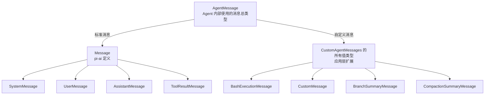
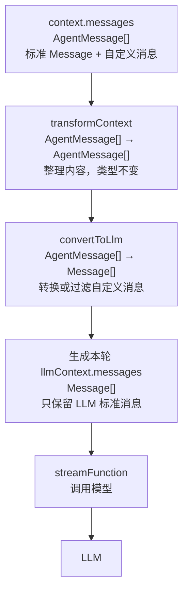
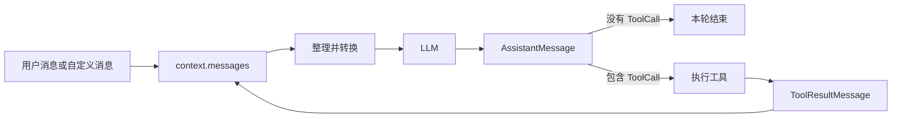

# 消息在 Pi 中的传递

Pi 的消息系统负责在用户输入、Agent 内部状态、LLM 和工具执行之间传递信息。`context.messages` 保存的是 Agent 的完整消息记录，真正交给 LLM 的内容则会在每次调用前重新整理和转换。

下面以用户在 Pi 中输入 `!ls -la` 为例，沿着这条命令产生的消息一路往下看。它会先被记录到哪里，经过哪些处理才能进入模型上下文，模型回复或发起工具调用后，新的消息又怎样回到消息列表并推动下一轮运行。

## 两个消息世界

Pi 没有要求所有模块共用一种消息格式，而是划出了两个范围。

`pi-ai` 定义了 LLM 层能够处理的标准 `Message`。它包含四种消息：

```ts
export type Message =
  | SystemMessage
  | UserMessage
  | AssistantMessage
  | ToolResultMessage;
```

`SystemMessage` 保存系统指令和工具变化，`UserMessage` 表示用户侧输入，`AssistantMessage` 是模型回复，`ToolResultMessage` 则必须对应模型发起的一次工具调用。

pi-agent-core 内部使用的范围更大，可以有自定义消息：

```ts
export interface CustomAgentMessages {}

export type AgentMessage =
  Message | CustomAgentMessages[keyof CustomAgentMessages];
```

这行代码可以拆成两步看。`keyof CustomAgentMessages` 先取出接口里的所有键，`CustomAgentMessages[...]` 再取出这些键对应的类型。假设接口里有 `bashExecution: BashExecutionMessage` 和 `custom: CustomMessage`，最终得到的就是 `BashExecutionMessage | CustomMessage`。再与标准 `Message` 做联合，便构成了 Agent 能保存的全部消息。

可以把 `CustomAgentMessages` 想成 Core 预留的一排空插槽。Coding Agent 通过 TypeScript 的声明合并，把自己的消息类型补充到这个接口中：

```ts
declare module "@earendil-works/pi-agent-core" {
  interface CustomAgentMessages {
    bashExecution: BashExecutionMessage;
    custom: CustomMessage;
    branchSummary: BranchSummaryMessage;
    compactionSummary: CompactionSummaryMessage;
  }
}
```

Core 先声明一个空的 `CustomAgentMessages`，Coding Agent 再声明一次同名接口。TypeScript 编译器会把两次声明合并起来，让 `AgentMessage` 自动包含这些新增类型。这里没有使用 `extends`，所以不是继承；也不需要回到 Core 里修改联合类型的范围。具体消息仍由 Coding Agent 定义，Core 只负责提供扩展入口。

把声明合并后的两边展开，`AgentMessage` 的包含关系如下。图中的连线表示联合类型由哪些成员组成，不是类之间的继承关系。



所以，标准 `Message` 和应用自定义消息不是两个互不相干的数组。它们共同组成 `AgentMessage`，并一起存放在 `context.messages: AgentMessage[]` 中。`AgentMessage` 是 Agent 内部能接收的总类型，`Message` 只是其中可以直接进入 LLM 层的一支。

这样，`context.messages: AgentMessage[]` 既能存标准对话，也能保存 Bash 执行记录、上下文压缩摘要、分支摘要和扩展注入的内容。`role` 就像消息胸前的身份牌，程序看到 `bashExecution`，便知道可以读取 `command`、`output`、`exitCode` 等字段。

这种设计的重点不是“类型更多”，而是原始信息没有被过早拍平成一段文字。UI 可以分别渲染命令、输出和退出状态；Session 恢复后也能重建原来的显示；至于模型需要看到什么，可以稍后再决定。

这里也能看出包之间的分工。`pi-ai` 只关心跨模型通用的消息，`pi-agent-core` 提供可扩展的联合类型和循环，Coding Agent 才定义终端交互所需的具体消息。Core 不需要反向依赖某个应用，却仍然能让 TypeScript 检查自定义消息，这比把所有业务类型硬塞进底层包更容易维护。

## `!ls -la` 为什么不是工具结果

用户直接输入 `!ls -la` 时，Coding Agent 会产生一条 `BashExecutionMessage`：

```ts
interface BashExecutionMessage {
  role: "bashExecution";
  command: string;
  output: string;
  exitCode: number | undefined;
  cancelled: boolean;
  truncated: boolean;
  fullOutputPath?: string;
  timestamp: number;
  excludeFromContext?: boolean;
}
```

它看起来很像工具执行结果，但两者的发起者不同。

- 用户输入 `!ls -la`，是用户直接触发 Bash，没有模型生成的 `ToolCall`，所以记录为 `BashExecutionMessage`。
- 模型决定调用 Bash 工具时，`AssistantMessage` 里会带有 `ToolCall`；执行结果才是 `ToolResultMessage`，并通过 `toolCallId` 与那次调用配对。

因此，判断一条结果属于哪种消息，不能只看“是不是执行了命令”，还要看是谁发起、走了哪条协议。

同一个 `context.messages` 里可能依次出现用户问题、模型回复、工具结果和用户手动执行的 Bash。它们能够混在一个数组中，但不会混为一谈，因为每条消息的 `role` 都保留着来源和语义。后续 UI 渲染、工具配对和上下文转换，都是根据这个身份继续处理。

## 调用模型前：先整理，再翻译

一条 `BashExecutionMessage` 加入 `context.messages` 后，并不会原样发给模型。真正的边界在 `streamAssistantResponse()`：



图中只画了一次模型调用前的单向准备过程。起点 `context.messages` 的类型是 `AgentMessage[]`，其中既有标准 `Message`，也有 Coding Agent 自己定义的消息。两类消息在这里合称为 `AgentMessage`，此时仍处在 Agent 内部。

第一步是可选的 `transformContext`。它负责裁剪旧消息、压缩历史或注入额外上下文，输入和输出都是 `AgentMessage[]`。消息内容和数量可能改变，但类型范围没有改变。换句话说，整理完成后，数组里仍然可以同时存在标准消息和自定义消息。

第二步是 `convertToLlm`。这一步才发生类型变化，输入是 `AgentMessage[]`，输出是 `Message[]`。原本属于标准 `Message` 的内容可以直接通过；`BashExecutionMessage`、摘要消息等自定义类型则需要转换成标准消息，或者根据规则被过滤。到这里，自定义消息类型不再出现在结果中。

转换得到的 `Message[]` 会在这里组成当前这一轮的 `llmContext.messages`，再交给 `streamFunction` 调用模型。它不是提前准备并长期保存的另一份消息历史，而是根据此刻的 `context.messages` 临时生成的模型视图。因此这条路线可以直接按类型记忆：`AgentMessage[]` 经过 `transformContext` 后仍是 `AgentMessage[]`，只有经过 `convertToLlm` 后才会收敛成 `Message[]`。

这两个步骤分开后，更换上下文管理策略不会影响消息翻译；增加新的业务消息，也不必重写裁剪逻辑。

在 Coding Agent 的实现中，`bashExecution` 会先经过 `bashExecutionToText()`：

```ts
let text = `Ran \`${msg.command}\`\n`;

if (msg.output) {
  text += `\`\`\`\n${msg.output}\n\`\`\``;
} else {
  text += "(no output)";
}
```

取消、非零退出码和输出截断也会追加成文字。也就是说，`cancelled`、`truncated` 这些独立字段在 LLM 版本中消失了，但重要语义仍保留在 `content` 里。最后得到的消息大致如下：

````ts
{
  role: "user",
  content: [{
    type: "text",
    text: "Ran `ls -la`\n```\n...命令输出...\n```"
  }],
  timestamp: 1750000000000
}
````

`CustomMessage`、`BranchSummaryMessage` 和 `CompactionSummaryMessage` 也采用同一种思路：把 Agent 专用结构表达成模型能读懂的 `UserMessage`。原本已经是 `system`、`user`、`assistant` 或 `toolResult` 的消息则直接通过。

## 保留记录，不等于必须让模型看见

`BashExecutionMessage` 还有一个很实用的字段：`excludeFromContext`。用户使用 `!!` 前缀执行命令时，它会被设为 `true`。`convertToLlm` 对此只做一个判断：

```ts
if (m.excludeFromContext) {
  return undefined;
}
```

后面的 `filter` 会移除这项。因此消息仍保存在 `context.messages` 中，UI 和 Session 都可以使用；但这一轮生成的 `llmContext.messages` 里没有它，模型完全看不见。

这里真正分清了两个概念：**保存的是 Agent 的事实记录，发送的是当前这一轮给模型看的视图。** 不让模型看，并不等于删除数据。

## 模型回复后，消息继续流动

`Message[]` 交给 `streamFunction` 后，Provider 层还会把 Pi 的统一格式转换成 OpenAI、Anthropic 等服务各自要求的请求格式。`convertToLlm` 解决的是“Agent 消息如何变成 Pi 的标准消息”，Provider 转换器解决的是“标准消息如何变成某家 API 的格式”，两层不要混在一起。

模型的流式响应会逐步组装成 `AssistantMessage`。源码先把 partial message 放进 `context.messages`，随着文本或工具调用事件到达不断替换它，完成后再留下最终消息。

如果回复只包含文本，这一轮可以结束；如果其中带有 `ToolCall`，Agent Loop 会执行工具，生成带相同调用 ID 的 `ToolResultMessage`，再把结果加入上下文并发起下一轮：



如果没有裁剪、压缩或过滤，下一次调用会再次提交当前保留下来的历史消息。模型并不是在服务端“永久记住”了对话，而是客户端每轮都把上下文重新送入请求。这也解释了为什么会话越长，输入 Token 越多，以及 Pi 为什么需要 `transformContext` 和压缩机制。

## 把整条路再走一遍

回到开头的 `!ls -la`。命令执行后，Pi 先创建带完整字段的 `BashExecutionMessage`，并把它加入 `context.messages`。当 Agent 准备请求模型时，`transformContext` 先从当前历史生成一份适合本轮使用的上下文；`convertToLlm` 再把 Bash 消息格式化成 `UserMessage`。如果该消息带有 `excludeFromContext: true`，它会在这里停止，不会进入后续请求。

转换后的 `Message[]` 经过 `normalizeContext` 形成 `llmContext`，再交给 `streamFunction`。具体 Provider 把统一消息翻译成目标 API 的请求格式，并把厂商返回的流式数据转成 Pi 能处理的事件。Agent Loop 一边接收事件，一边更新 `AssistantMessage`，最终把完整回复留在 `context.messages`。

若回复要求调用工具，流程不会另起一套系统。`AssistantMessage` 中的 `ToolCall` 被执行后，结果包装成 `ToolResultMessage`，写回同一个上下文；下一轮依旧从“整理—转换—调用”开始。消息因此不是单向管道中的一次性数据，而是循环中不断增加的状态。用户输入、模型决定和外部执行结果，都在同一份历史里留下可追踪的位置。

把这个过程类比成寄快递会更直观：`context.messages` 是仓库原始台账，里面的信息最完整；`transformContext` 决定这次要装哪些货；`convertToLlm` 按运输标准重新包装；Provider 转换器再填写不同快递公司的面单。包裹送达后得到的新回执，又会登记回仓库，成为下一次发货的依据。

## 小结

Pi 的消息传递可以浓缩成一句话：**内部保留完整结构，到 LLM 边界再生成适合模型阅读的版本。**

`context.messages` 是 Agent 的完整世界，既服务于界面、持久化，也服务于后续上下文处理；`llmContext.messages` 是某一轮调用临时生成的标准化视图。`transformContext` 决定“保留和整理什么”，`convertToLlm` 决定“这些内容怎样让模型理解”，Provider 转换器再负责适配具体 API。

沿着 `!ls -la` 走完一圈后，消息系统就不再只是几个 TypeScript 类型，而是一条清晰的循环：记录现实、整理上下文、翻译给模型、接收回答，必要时执行工具，再把新结果放回历史中。

## 源码参考

- [Pi 官方源码仓库](https://github.com/earendil-works/pi)
- [`pi-ai` 的标准消息类型](https://github.com/earendil-works/pi/blob/main/packages/ai/src/types.ts)
- [`pi-agent-core` 的 `AgentMessage` 与上下文转换接口](https://github.com/earendil-works/pi/blob/main/packages/agent/src/types.ts)
- [Agent Loop 中的消息转换与回写](https://github.com/earendil-works/pi/blob/main/packages/agent/src/agent-loop.ts)
- [Coding Agent 的自定义消息与 `convertToLlm`](https://github.com/earendil-works/pi/blob/main/packages/coding-agent/src/core/messages.ts)
