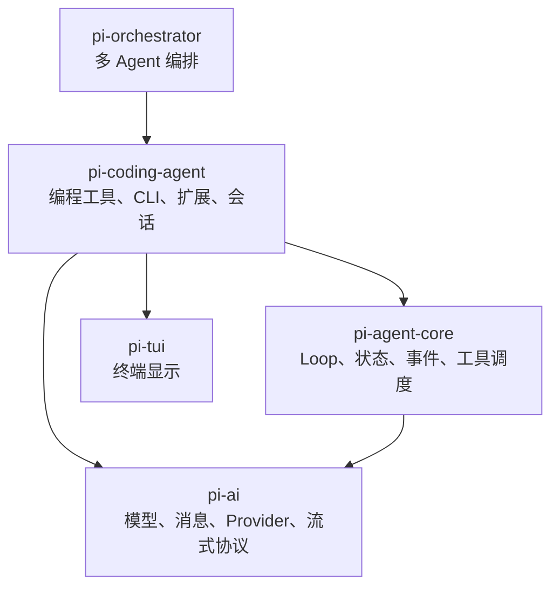
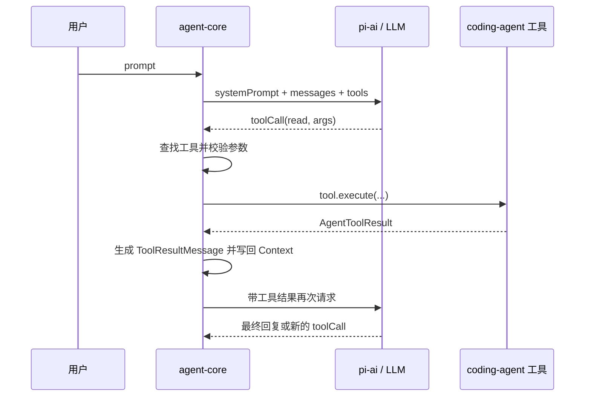

# 从模型调用到编程助手：我对 Pi Agent 三层架构的理解

最近开始读 Pi Agent 源码，算是慢慢摸清了这个项目的骨架。刚打开仓库的时候，我看到 `pi-ai`、`pi-agent-core`、`pi-coding-agent` 这一串包名，第一反应是先把每个包的职责背下来。结果单独看都能看懂，放在一起反而容易乱。

后来我不再按目录读，而是顺着一个 `read` 工具往下追。假设模型想看 `package.json`，`pi-ai` 先用统一格式告诉模型：“这里有个 `read` 工具可以用。”模型发回 `toolCall`，`pi-agent-core` 找到对应工具并调用 `execute()`。至于真正打开文件、读出内容的那段代码，则放在 `pi-coding-agent` 里。读完的结果还要塞回 Context，让模型接着判断下一步。

这一圈走下来，三个包终于连上了。工具调用就是藏在三层之间的那条线：`pi-ai` 让模型认识工具，Core 负责调工具，Coding Agent 负责把工具做出来。后面再看目录，思路就顺了很多。

我也因此想明白了 Model 和 Agent 的区别。Model 做的是“根据输入生成输出”，它不会自己维持任务循环，也不会天然拥有读文件、跑命令这些能力。Pi 在模型外面加上 Loop、Context、工具和状态管理，模型才有了连续做事的能力。这层运行系统，就是这里说的 Agent Harness 或 Agent Runtime。

## 1. 先看整体结构



这张图有一点容易看反：箭头画的是依赖方向，所以 `pi-coding-agent` 会指向 Core 和 `pi-ai`。换成“能力是怎么一层层搭起来的”这个角度，就是 `pi-ai → pi-agent-core → pi-coding-agent`。先把模型接进来，再让循环跑起来，最后装上编程工具。旁边的 `pi-tui` 管终端显示，`pi-orchestrator` 管多个 Agent 的协调，暂时不影响这条主线。

### pi-ai：统一模型世界

我先追到的是 `pi-ai`。模型要调用 `read`，总得先知道这个工具叫什么、能干什么、参数该怎么传。`Tool` 类型保存的就是这份说明：

```ts
type Message = UserMessage | AssistantMessage | ToolResultMessage;

interface Tool<TParameters> {
  name: string;
  description: string;
  parameters: TParameters;
}
```

这里有个细节我觉得很有意思：`Tool` 里面没有 `execute()`。也就是说，`pi-ai` 只是把工具介绍给模型，文件到底怎么读、失败了怎么处理，它都不管。

模型调用也是同样的思路。OpenAI、Anthropic、Google 的请求格式和流式事件不完全一样，`pi-ai` 把这些差别挡在这一层。到了上面，大家用的都是 `Message`、`Model` 和 `Tool`，不用每换一家 Provider 就重写一遍流程。

### pi-agent-core：让模型持续行动

模型已经选中了 `read`，但 `toolCall` 只是在说“我想用这个工具”，并不会真的把文件读出来。接下来的活由 `pi-agent-core` 接手。

Core 是通用 Runtime。消息怎么保存、Loop 怎么往下走、工具什么时候执行、运行中要发什么事件，都归它管。不过它并不知道 `read` 是读文件，也不知道 `bash` 会启动命令。它只认一个统一的 `AgentTool` 接口：

```ts
interface AgentTool<TParameters, TDetails> extends Tool<TParameters> {
  label: string;
  execute(...): Promise<AgentToolResult<TDetails>>;
  executionMode?: "sequential" | "parallel";
}
```

我之前对这里有点绕：既然 Core 不知道 `read` 的实现，它怎么执行工具？答案就在 `execute()`。Core 只要把参数传进这个统一入口，再接住返回结果就行。至于入口后面连的是读文件、查数据库还是跑测试，Core 不需要知道。

把它想成插座会简单一些。插座只规定插头的形状，不关心接进来的是台灯还是电脑。只要工具符合 `AgentTool` 接口，Core 就能调用。熟悉 Java 的话，这基本就是面向接口编程和多态。

### pi-coding-agent：把通用能力变成产品

那 `read` 到底在哪里？答案是 `pi-coding-agent`。这一层最清楚编程助手需要什么，所以真正的 `read`、`edit`、`bash` 都写在这里。CLI、扩展、权限和结果怎么显示，也属于这一层。

例如源码里的 `createReadToolDefinition()`，里面放了 `read` 的参数、执行逻辑和显示方式，然后再通过 `wrapToolDefinition()` 包成 Core 认识的 `AgentTool`。到这一步，三层才算接齐：模型知道它能用，Runtime 知道怎么调，业务层负责把事情做完。

这样拆还有一个直接好处。以后做的不是 Coding Agent，而是 Data Agent，就注册 `query_database`；做 Testing Agent，就换成 `run_test`。Core 还是原来那个 Core，不用把循环重写一遍。

## 2. 一次工具调用到底怎样跑完

前面的分工落到 `agent-loop.ts` 里，就变成了一次真正的接力。整条路径大概是这样：



源码里要盯住的就两步：调用 `execute()`，然后把结果放回消息列表。

```ts
const result = await prepared.tool.execute(
  prepared.toolCall.id,
  prepared.args,
  signal,
  onUpdate,
);

// 执行结果包装成 ToolResultMessage 后，写回本轮上下文
for (const result of toolResults) {
  currentContext.messages.push(result);
  newMessages.push(result);
}
```

第一次看到这里时，我的注意力全在 `execute()` 上，觉得工具跑完就结束了。其实后面的写回更重要。Core 会把结果包装成 `ToolResultMessage`，放回 Context，再去问一次模型。模型看过结果，可能直接回答，也可能接着调用另一个工具。

所以 Agent 并不是“模型加一个工具”这么简单。它还得把每次行动的结果带回下一轮。少了这一步，模型做完一次调用就断线了，也就谈不上连续完成任务。

## 3. 分层的重点是依赖方向

我一开始还把“分层”理解得太死，觉得上层只能调用紧挨着的下一层。可实际代码不是这样。`pi-coding-agent` 除了依赖 `pi-agent-core`，也会直接使用 `pi-ai` 里的 `Message`、`Model`、`ImageContent`。这些是大家共用的基础类型，没必要绕一圈才能拿到。

因此，跨层引用本身没问题，方向反过来才麻烦。Pi 里的依赖大致遵守下面这条线：

```text
允许：coding-agent → agent-core → pi-ai
允许：coding-agent ───────────→ pi-ai
禁止：pi-ai → agent-core / coding-agent
禁止：agent-core → coding-agent
```

比如让 Core 直接导入 `ReadTool`，短期看很省事，代价是 Core 开始知道“读文件”这种具体业务。以后想拿它去跑数据 Agent 或测试 Agent，就会越来越别扭。保持单向依赖，底层才能单独测试、发布，也更容易被替换。

## 4. 类型也在逐层增加责任

把几个类型摆在一起看，也能看出工具是怎么一层层长出来的：

| 层级 | 类型 | 关注的问题 |
| --- | --- | --- |
| pi-ai | `Tool` | 模型怎样理解这个工具 |
| pi-agent-core | `AgentTool` | Runtime 怎样执行并调度它 |
| pi-coding-agent | `ToolDefinition` | 业务怎样实现、扩展和展示它 |

还是拿 `read` 举例。`Tool` 只告诉模型“我能读取文件”；到了 `AgentTool`，多了 `execute()`，Runtime 终于有了调用入口；`ToolDefinition` 又补上执行细节和渲染方式，这才成了 Coding Agent 里可以直接使用的工具。

消息的处理也很像。`pi-ai` 的 `Message` 只放模型能理解的标准消息，Core 的 `AgentMessage` 则允许应用加入自己的消息。等到真的要请求模型时，`convertToLlm` 再做一次转换或过滤。这样 UI 通知、压缩摘要可以留在 Agent 内部，不会一股脑发给 Provider。

## 5. 放到企业 Agent 平台里看

看到这里，再把视角拉到企业 Agent 平台，很多名词就能对上了。`pi-agent-core` 像平台里那套共用的 Harness，管循环、Context、工具调度和生命周期；`pi-coding-agent` 更像一个已经装好专业工具的业务 Agent。再往外一层，多个 Agent 怎么分工、交接任务、由谁监督，才轮到多 Agent 编排。

Sandbox 的位置也可以顺着工具调用去找。Runtime 能在 `beforeToolCall` 里拦住一次调用，在 `afterToolCall` 里处理结果，还能通过 `AgentEvent` 记录执行过程。但文件目录能访问到哪里、哪些命令可以跑、网络要不要放开，这些隔离规则仍然要落在工具或执行环境里。它们会配合工作，但不是一回事。

Session 也不只是把聊天内容存下来。一个长任务想从中断处恢复，消息、工具结果、当前状态和必要的运行信息都得保住。Pi 先把这些通用部分从业务工具里拆开，后面加持久化、人工介入、Trace 或任务恢复时，就不用每个专业 Agent 各写一套。

## 6. 三层不是固定套餐

三层并不是必须一起使用。选到哪一层，主要看准备自己负责多少东西：

| 需求 | 合适的组合 |
| --- | --- |
| 只想统一调用和流式读取模型 | 只用 `pi-ai` |
| 想做自己的垂直 Agent | `pi-ai + pi-agent-core + 自定义工具` |
| 想直接获得完整编程助手能力 | 使用完整三层 |

这也解释了“读 Pi 源码”和“用 Pi 写项目”的区别。读源码时，我关心的是 `agentLoop` 怎么转、Context 怎么更新、工具怎么被调度。真正拿 Pi 做项目时，Runtime 已经在下面工作了，更多精力会放在 System Prompt、业务工具、Hook 和服务接口上。

比如基于 Pi 做一个 Data Agent，做的是在现成 Runtime 上加一层数据业务能力，并不是从头再造一个 Agent Framework。两件事都叫“做 Agent”，工作量和关注点差得很远。

## 结语

回头再看这三个包，我已经不太需要硬记它们的职责了。顺着一次工具调用走就行：模型层负责描述，Runtime 负责调度，业务层负责执行。`Tool`、`AgentTool` 和 `ToolDefinition`，正好把这条路上的分工写进了类型里。

以后再看类似的 Agent 项目，我会先画依赖箭头，然后问两件事：拿掉上层，底层还能不能单独工作？底层有没有偷偷知道某个具体业务？前一个答案是“能”，后一个答案是“没有”，这套分层一般就比较稳。

## 参考资料与源码

- [三层架构解读文章：Pi-Agent 项目的骨骼](https://dg-ai-notes.pages.dev/modules/ch02-three-layer-arch/)
- [Pi Agent GitHub 源码仓库](https://github.com/earendil-works/pi)
- [pi-ai 基础类型](https://github.com/earendil-works/pi/blob/main/packages/ai/src/types.ts)
- [pi-agent-core 类型与工具协议](https://github.com/earendil-works/pi/blob/main/packages/agent/src/types.ts)
- [Agent Loop 源码](https://github.com/earendil-works/pi/blob/main/packages/agent/src/agent-loop.ts)
- [read 工具实现](https://github.com/earendil-works/pi/blob/main/packages/coding-agent/src/core/tools/read.ts)
