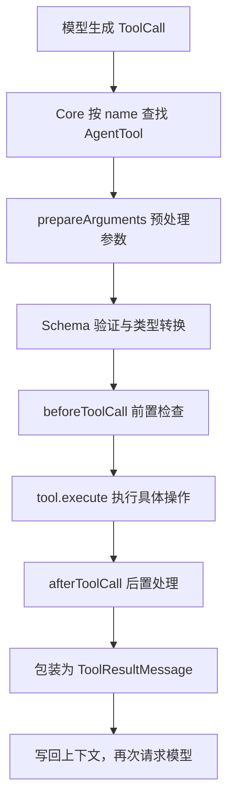

# Pi Agent 工具调用到底发生了什么？

很多人都会有一个误解：大模型说要使用工具它自己就会直接去找到对应工具并使用。其实大语言模型本身只负责生成内容，它既不会直接访问硬盘，也不会自己运行命令。所谓“工具调用”，本质上是模型先生成一张结构化的申请单，再由模型外部的 Agent Runtime 找到对应程序、检查参数、执行操作，最后把结果交还给模型。

如果把 Agent 想成一家餐厅，模型更像负责点单的服务员：它知道菜单上有哪些菜，也知道应该怎样填写订单，但真正切菜、开火的是后厨。Pi 的工具系统，就是连接“点单”和“做菜”的那套流程。

## 一、工具不是一个函数，而是三层契约

在 Pi 中，同一个工具会以三种不同的形态出现。

第一层是 `pi-ai` 中的 `Tool`。它只保留模型需要知道的信息：

```ts
interface Tool {
  name: string;
  description: string;
  parameters: TSchema;
}
```

例如，`read` 的名字是什么、可以做什么、参数中必须有 `path`，这些信息会被发送给模型。它很像菜单：只负责告诉模型“能点什么”和“应该怎样点”，并不包含真正的文件读取逻辑。

第二层是 `pi-agent-core` 中的 `AgentTool`。它在 `Tool` 的基础上加入 `execute`、`prepareArguments`、`executionMode` 等运行时能力。到了这一层，工具不再只是说明书，而是成为 Agent Loop 可以查找和执行的统一对象。

把泛型和部分次要字段省略后，`AgentTool` 的核心结构可以理解为：

```ts
interface AgentTool extends Tool {
  label: string;

  prepareArguments?: (args: unknown) => ToolArguments;

  execute(
    toolCallId: string,
    params: ToolArguments,
    signal?: AbortSignal,
    onUpdate?: AgentToolUpdateCallback
  ): Promise<AgentToolResult>;

  executionMode?: "sequential" | "parallel";
}
```

它继承了 `Tool` 中给模型看的 `name`、`description` 和 `parameters`，同时增加真正执行工具所需的能力。`prepareArguments` 可以在 Schema 验证前整理参数；`execute` 负责执行工具；`executionMode` 则决定多个工具调用应该顺序执行还是可以并行执行。

第三层是 `pi-coding-agent` 中的 `ToolDefinition`。Coding Agent 不仅要执行工具，还要考虑终端界面、系统提示词、扩展上下文和结果渲染，所以这里又增加了 `promptSnippet`、`promptGuidelines`、renderers，以及传给 `execute` 的 `ExtensionContext`。

精简后的 `ToolDefinition` 大致如下：

```ts
interface ToolDefinition {
  name: string;
  label: string;
  description: string;
  parameters: TSchema;

  promptSnippet?: string;
  promptGuidelines?: string[];

  prepareArguments?: (args: unknown) => ToolArguments;
  executionMode?: "sequential" | "parallel";

  execute(
    toolCallId: string,
    params: ToolArguments,
    signal: AbortSignal | undefined,
    onUpdate: AgentToolUpdateCallback | undefined,
    ctx: ExtensionContext
  ): Promise<AgentToolResult>;

  renderCall?: (...) => Component;
  renderResult?: (...) => Component;
}
```

这里既包含工具的基础说明和执行逻辑，也包含 Coding Agent 产品层需要的信息。`promptSnippet` 和 `promptGuidelines` 用来影响系统提示词，`ExtensionContext` 为工具提供当前工作目录、模型等运行环境，而 `renderCall` 和 `renderResult` 则负责在终端界面中展示调用过程和执行结果。

三层之间并不是三套互不相关的工具。`wrapToolDefinition()` 会把上层的 `ToolDefinition` 包装成 Core 能识别的 `AgentTool`。它还会通过闭包，在执行时补入 `ExtensionContext`。

这样一来，Agent Core 只需要面对统一的 `execute()` 契约，不必知道 `read`、`bash` 或某个扩展工具内部究竟怎样工作。

这也是整套设计最重要的分工：

- `pi-ai` 负责让模型看懂工具；
- `pi-agent-core` 负责调度工具；
- `pi-coding-agent` 负责实现工具，并把它做成完整产品。

## 二、模型返回的不是结果，而是一张调用单

在请求模型之前，Pi 会把当前可用工具的声明放进上下文。不同 Provider 对工具的格式要求并不完全相同，因此具体的 Provider translator 会再把统一的工具定义转换成各家 API 所需的格式。

当模型判断需要读取文件时，它不会假装已经看过文件，而是返回一个统一的 `ToolCall`：

```ts
{
  type: "toolCall",
  id: "call_123",
  name: "read",
  arguments: {
    path: "src/main.ts"
  }
}
```

这里的 `id` 很重要。一次回复中可能出现多个工具调用，之后返回的每个结果都要通过 `toolCallId` 与原调用配对。

`name` 用来寻找工具，`arguments` 则是模型填写的参数。

到这一步为止，文件仍然没有被读取。模型只是说：

> 请调用名为 `read` 的工具，并把这组参数交给它。

真正的执行从 Agent Core 接手之后才开始。

## 三、一条完整的工具调用流水线

下面这张图概括了 Pi 当前的主要调用链：



接下来继续用 `read("src/main.ts")` 拆开每一步。

### 1. 按名称找到工具

Core 会在 `currentContext.tools` 中查找名字等于 `read` 的工具。

如果找不到，它不会让整个 Agent Loop 崩溃，而是创建一条错误结果，例如：

```text
Tool read not found
```

对模型而言，这仍然是一条可以理解的工具反馈。模型可以根据这条反馈改用其他方法，或者重新尝试。

### 2. `prepareArguments`：先处理兼容问题

模型给出的参数有时会受到旧会话、旧 Schema 或 Provider 差异的影响。工具可以提供可选的 `prepareArguments`，在正式验证前对原始参数进行兼容性处理。

它不是一个“什么错误都能自动修好”的魔法层。更准确地说，它是参数进入安检前的整理台。

没有定义这个函数的工具，会直接使用模型给出的原始参数。

### 3. `validateToolArguments`：参数必须符合 Schema

整理后的参数会交给 `validateToolArguments()`。

Pi 会复制参数、处理可选字段中的 `null`、尝试合理的类型转换，再使用工具的 TypeBox Schema 检查结果。

假如模型漏掉了必填的 `path`，或者给出了错误的数据结构，验证就会失败。此时真正的文件操作不会执行，错误信息会被包装成工具结果返回。

因此，Schema 不只是给模型看的格式提示，也是 Runtime 在执行真实操作前的一道边界。

### 4. `beforeToolCall`：执行前的安检口

参数验证通过后，Pi 会调用可选的 `beforeToolCall` hook。

上层可以在这里检查路径、记录审计信息、要求用户确认，或者直接返回：

```ts
{ block: true }
```

这样就可以阻止工具继续执行。

需要注意的是hook 提供的是一个策略插入口，并不代表 Pi 默认内置了完整的权限系统。

Pi 默认继承启动进程本身拥有的权限。如果需要更严格的文件、进程或网络边界，仍然需要由扩展、沙箱或容器提供。

### 5. `execute`：真正干活的地方

通过检查后，Core 才会调用：

```ts
tool.execute(toolCallId, validatedArgs, signal, onUpdate)
```

对于 `read`，包装器会把调用继续交给 `ToolDefinition.execute()`，并补入当前工作目录、模型信息等扩展上下文。

随后，`read` 会依次完成这些工作：

1. 解析文件的绝对路径；
2. 检查文件是否存在并且可读；
3. 判断文件是文本还是图片；
4. 调用底层 `ReadOperations` 读取内容；
5. 根据长度限制截断结果；
6. 把文本或图片包装成工具结果。

`ReadOperations` 默认使用本地文件系统，但它可以被替换。

例如，同一个 `read` 工具可以把读取操作委托给 SSH 或沙箱环境，而上面的 Agent Loop 不需要跟着重写。

这就像插座的形状保持不变，背后接的是本地电源还是远程电源，可以由运行环境决定。

工具还可以通过 `onUpdate` 发送部分进度，`AbortSignal` 则让外部有机会取消正在进行的操作。

执行期间抛出的异常也会被捕获并转换成错误结果，而不是直接让整轮对话崩溃。

### 6. `afterToolCall`：结果交付前再处理一次

工具执行结束后，可选的 `afterToolCall` hook 会收到：

- 已经验证的参数；
- 原始执行结果；
- 当前的错误状态；
- Agent 的上下文。

它可以替换 `content`、`details`、`isError` 或 `terminate` 等字段。

因此，可以把两个 hook 简单地区分为：

- `beforeToolCall` 处理“能不能做”；
- `afterToolCall` 处理“结果以什么状态交出去”。

如果后置 hook 自己抛出错误，Pi 也会把这个异常转换为错误工具结果。

### 7. 包装成 `ToolResultMessage`

最终结果会被整理成一条标准消息：

```ts
{
  role: "toolResult",
  toolCallId: "call_123",
  toolName: "read",
  content: [
    {
      type: "text",
      text: "...文件内容..."
    }
  ],
  details: { ... },
  isError: false,
  timestamp: ...
}
```

`content` 是交给模型阅读的文本或图片，`details` 更适合保存供日志和 UI 使用的结构化信息。

两者分开以后，模型上下文和界面展示就不必被限制在同一种数据结构中。

## 四、为什么结果还要再次交给模型？

工具只负责完成一个具体动作，并不负责决定整个任务是否结束。

`read` 可以返回文件内容，却不知道用户究竟想让 Agent 修复 bug、解释代码，还是继续搜索其他文件。

所以，Agent Loop 会把 `ToolResultMessage` 同时加入 `currentContext.messages` 和本轮的 `newMessages`，然后进入下一轮模型调用。

模型现在能看到“刚才读到了什么”，于是可以继续推理：

- 信息已经足够，就生成最终回答；
- 还缺少上下文，就再调用一次 `read` 或 `grep`；
- 发现需要修改，就继续调用 `edit`；
- 工具返回错误，就调整参数后重试。

这正是 Agent 与普通聊天模型的核心区别。

它不是一次请求对应一次回答，而是形成了下面这个循环：

```text
模型决定动作
    ↓
Runtime 执行动作
    ↓
模型读取结果
    ↓
决定下一步动作
```

## 五、几个容易忽略的保护设计

Pi 的工具调用并不只考虑成功路径。

### 回复被截断时，不执行残缺调用

如果模型回复因为 token 上限而被截断，即使残缺参数碰巧还能通过 JSON 解析，Pi 也不会冒险执行。

它会把相关调用全部标记为错误，让模型重新发出完整请求。

这是因为“JSON 能解析”不代表“参数一定完整”。如果被截断的恰好是一个可选字段，残缺调用甚至可能通过 Schema 验证，但它表达的已经不是模型原本想执行的操作。

### 多个工具可以顺序或并行执行

如果一条回复中含有多个工具调用，Runtime 可以顺序执行，也可以并行执行。

某个工具还可以把自己的 `executionMode` 指定为 `sequential`，表示它必须按顺序执行。

并行执行时，各个工具可能在不同时间完成，但结果消息仍然会按照模型原来的调用顺序写回，避免上下文顺序变得难以理解。

### `terminate` 和 `stopReason` 不是一回事

工具结果可以带上：

```ts
terminate: true
```

它表示工具希望 Runtime 不要自动开始下一轮模型调用。

不过，只有当前批次中的每一个最终工具结果都要求终止时，整批调用才会提前停下。

`terminate` 和模型的 `stopReason` 不是同一个概念：

- `terminate` 是工具阶段提供给 Runtime 的提示；
- `stopReason` 描述模型这一轮为什么停止生成。

## 六、重新回答开头的问题

现在可以完整回答：“当模型说要读取一个文件时，到底发生了什么？”

模型首先根据工具说明生成 `ToolCall`；Agent Core 按名称找到工具，预处理并验证参数，再经过前置 hook；具体工具通过 `execute` 和可替换的 Operations 完成真实的文件访问；执行结果经过后置 hook，被包装为 `ToolResultMessage` 写回上下文；Agent Loop 随后再次调用模型，直到模型不再请求工具，或者运行流程决定结束。

也就是说：

- 模型负责选择和推理；
- 工具负责执行具体行动；
- Agent Runtime 负责把两者稳定地连接起来。

理解这条边界以后，Pi 的工具系统就不再像某种“模型突然拥有了电脑能力”的黑魔法，而更像一套分层清楚、可以检查、替换和扩展的调用协议。

## 源码参考

- [`packages/ai/src/types.ts`](https://github.com/earendil-works/pi/blob/d5629e20489ccf770ed90b5a33941cb3b7ef24d0/packages/ai/src/types.ts)：`Tool`、`ToolCall`、`ToolResultMessage` 等基础类型
- [`packages/ai/src/utils/validation.ts`](https://github.com/earendil-works/pi/blob/d5629e20489ccf770ed90b5a33941cb3b7ef24d0/packages/ai/src/utils/validation.ts)：工具参数验证
- [`packages/agent/src/types.ts`](https://github.com/earendil-works/pi/blob/d5629e20489ccf770ed90b5a33941cb3b7ef24d0/packages/agent/src/types.ts)：`AgentTool`、前后置 hook 与执行结果
- [`packages/agent/src/agent-loop.ts`](https://github.com/earendil-works/pi/blob/d5629e20489ccf770ed90b5a33941cb3b7ef24d0/packages/agent/src/agent-loop.ts)：工具调度、执行和结果回写
- [`packages/coding-agent/src/core/extensions/types.ts`](https://github.com/earendil-works/pi/blob/d5629e20489ccf770ed90b5a33941cb3b7ef24d0/packages/coding-agent/src/core/extensions/types.ts)：`ToolDefinition`
- [`packages/coding-agent/src/core/tools/tool-definition-wrapper.ts`](https://github.com/earendil-works/pi/blob/d5629e20489ccf770ed90b5a33941cb3b7ef24d0/packages/coding-agent/src/core/tools/tool-definition-wrapper.ts)：`ToolDefinition` 到 `AgentTool` 的适配
- [`packages/coding-agent/src/core/tools/read.ts`](https://github.com/earendil-works/pi/blob/d5629e20489ccf770ed90b5a33941cb3b7ef24d0/packages/coding-agent/src/core/tools/read.ts)：`read` 工具与 `ReadOperations` 的具体实现
